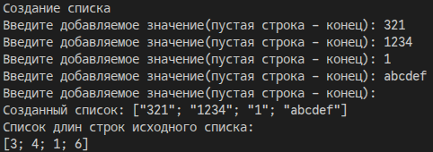
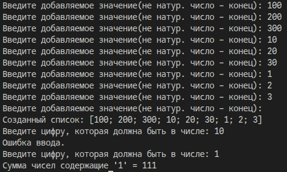

# Сурков Яков КМБ-1 Лабораторная №2

# Задание 1. List.map
## Задача 4
### Текст задачи
Получить список из длин строк, содержащихся в исходном списке.

### Описание логики работы
В программе сначала создается список, путем вызова рекурсивной функции, которая запрашивает добавляемое значение у пользователя:
 - если это пустая строка, возвращается готовый список
 - иначе рекурсивно вызываем эту функцию, которой на вход дается изначальный список, к которому добавили значение пользователя.
Далее программа создает новый список, проходя каждому значению созданного списка функцией которая возвращает количество символов элемента

### Тестирование

# Задание 2. List.fold
## Задача 4
### Текст задачи
Найти сумму тех элементов списка, в которых встречается заданная цифра.

### Описание логики работы
В программе сначала создается список, путем вызова рекурсивной функции, которая запрашивает добавляемое значение у пользователя:
 - если это не натуральное число, возвращается готовый список
 - иначе рекурсивно вызываем эту функцию, которой на вход дается изначальный список, к которому добавили значение пользователя.
Дальше мы запрашиваем у пользователя значение, которое будем искать в каждом числе списка.
Потом программа проходит по всем элементам списка функцией которая  проверяет каждое значение, на наличие в нем цифры(через рекурсивную функцию, которая поэтапно сравнивает каждую цифру с заданной цифрой):
 - Если цифра найдена, то мы возвращаем исходное значение(аккумулятор) плюс значение самого элемента
 - иначе мы просто возвращаем исходное значение
По итогу мы выводим полученное значение, что является результатом программы

### Тестирование

